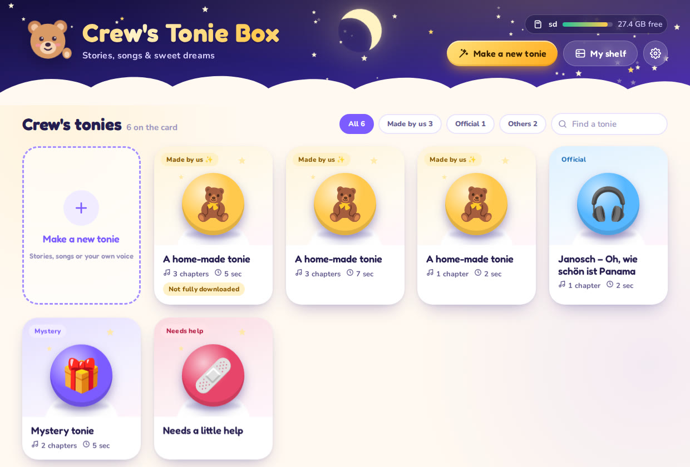
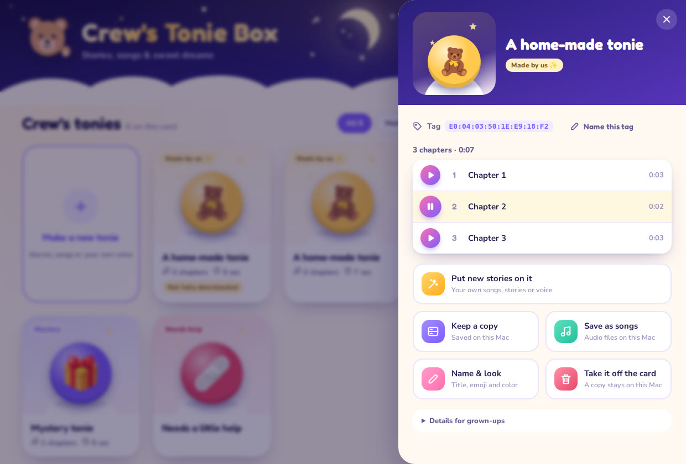
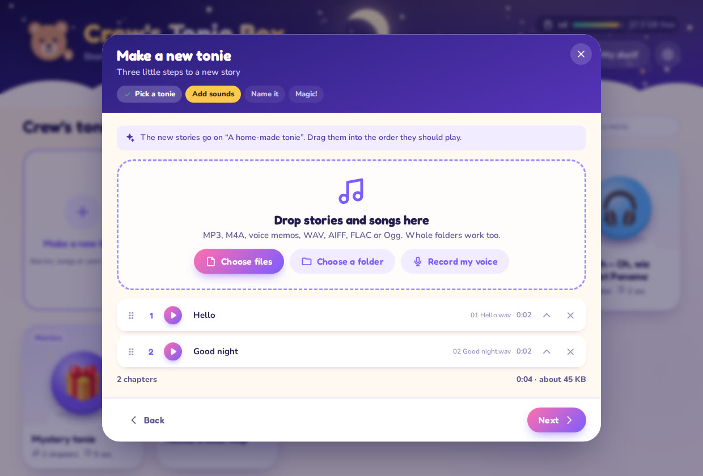
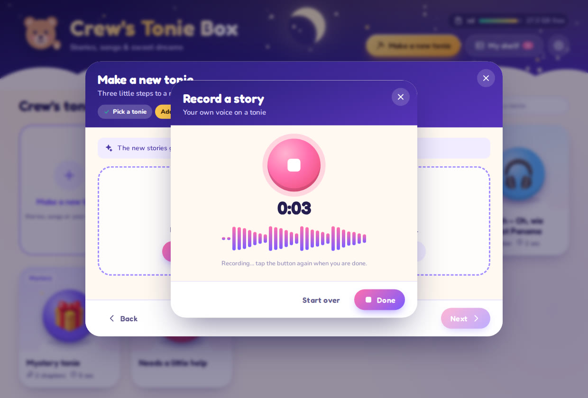

# Crew's Tonie Box

A friendly Mac app for the Toniebox SD card. Listen to every tonie on it, put your own stories,
songs and recordings on any tonie, and keep copies of everything. It is built on
[teddy](https://github.com/toniebox-reverse-engineering/teddy), the community's tonie file tool,
with its audio engine rebuilt and its bugs fixed.



- **Download:** `Crews-Tonie-Box-1.0.0-macos-arm64.zip`, the `crews-tonie-box-macos-arm64`
  artifact of the latest [workflow run](https://github.com/penfouky/home-services-ontario/actions/workflows/crews-tonie-box.yml), or build
  it yourself (below).
- **Needs** a Mac with Apple Silicon (M1 or newer) and macOS 12 Monterey or newer. Nothing else.
- **First start:** the app isn't from the App Store, so macOS asks once. On macOS 15 or newer,
  click *Done*, then *System Settings › Privacy & Security › Open Anyway*. On macOS 12–14,
  right-click the app and choose *Open*. `Read me first.txt` in the zip has the details.

## What it does

| | |
|---|---|
| **Finds the card by itself** | Put the Toniebox's SD card into the Mac and its tonies show up, with names and pictures for official tonies from the community [tonies.json](https://github.com/toniebox-reverse-engineering/tonies-json) (6,500+ tonies, built in and refreshed weekly). |
| **Works with every kind of tonie** | Official tonies, Creative-Tonies, box sounds, tonies made with teddy, TeddyBench or this app, and unknown ones ("mystery"). Downloads the box never finished and damaged files are shown as such, and never break the list. |
| **Listen** | Play any chapter. Playback starts right away, even for hour-long chapters, and you can jump anywhere. |
| **Make a tonie** | Three steps: pick the tonie (its tag), add sounds, name it. MP3, M4A/AAC, Apple Lossless, voice memos, WAV (also 24-bit/float), AIFF, FLAC, CAF, Ogg Vorbis and Opus, or whole folders. Drag files anywhere onto the window, reorder chapters by dragging, name each chapter. |
| **Custom playlists** | Build a new tonie from a mix of sources — pull individual chapters out of tonies already on the card or shelf, add your own files and recordings, and drag them all into the order you want. |
| **Record a story** | Record your voice right in the app, listen to it, and add it as a chapter. |
| **Free audiobooks** | Search [LibriVox](https://librivox.org) (public-domain audiobooks read by volunteers) by title or author and add chapters straight into a tonie. Downloads are limited to LibriVox/archive.org, so it stays a public-domain importer. |
| **Set up a new card** | A Toniebox card is a plain microSD with a `CONTENT` folder, and one card holds as many tonies as it has room for. "Prepare a card" adds `CONTENT` to a blank FAT32/exFAT card; on macOS, "Erase & format" wipes a blank card to FAT32 (behind a typed confirmation). |
| **Read a tag with a reader** | If a [Proxmark3](https://github.com/RfidResearchGroup/proxmark3) (or another ISO 15693 reader) is connected, "Scan a tag" reads a tag's ID so you can put custom stories on a blank NFC tag without opening a figurine. It only reads the ID — it never clones tonies you don't own. |
| **A picture for each tonie** | Pick from original storybook characters (princess, prince, mermaid, fairy, hero, wizard, pirate, astronaut, knight, robot, dragon, snowman, genie), a large emoji set and colors, or **use your own photo** — a snap of the figurine or of your child. No third-party character artwork is bundled; the characters are original archetypes drawn for this app. |
| **Tonie library** | Browse the full official catalog (6,500+ tonies) as a visual reference: pictures, series, language, the **article/item number** and each tonie's **chapter names**, all searchable. It's a reference only — it doesn't (and legally can't) download official audio or reassign tag IDs. |
| **Rename chapters** | Chapters are named when you make a tonie, and a home-made tonie's chapter names can be edited later. |
| **Nothing gets lost** | Before anything on the card is replaced or removed, a copy goes to *My shelf*. Tonies are written next to the old file, read back, compared and only then swapped in. Like TeddyBench, it keeps the tonie's audio ID by default, which helps an online Toniebox keep your stories. |
| **My shelf** | Copies, and tonies made for later. Listen to them, put them on any tag, or save them as songs. |
| **Save as songs** | Chapters as M4A files for the Music app (or Ogg/WAV), in *Music › Crew's Tonie Box*. |
| **Little helpers** | Nicknames for tags ("the blue hat one"), tidy up the `._` files Macs leave on cards, eject the card, pick the child's name for the title. |





## Fixed and improved compared to teddy 1.7.0

| teddy 1.7.0 | Now |
|---|---|
| At 48 kbps, TeddyBench's default, the last packet of every 4 KiB page was cut short to make it fit: a glitch every 0.7 s (6.3 dB level jumps) | Packets are never cut. Pages are filled exactly by padding earlier packets with Opus padding bytes (RFC 6716, 3.2.5), which decoders skip: 0.27 dB, the encoder's own variation |
| Chapter marks pointed to the page after a track ended, so every chapter started with the end of the one before | Each chapter starts on a fresh page with its own first packet. The page before is completed with at most 60 ms of silence |
| Chapters saved with `-m decode` started mid-stream and strict decoders (libopus' `opusinfo`) rejected them | Every chapter is a standalone Ogg Opus file with a correct pre-skip and 80 ms of decoder warm-up |
| Concentus, a C# port of libopus 1.1 | libopus 1.6.1, built from source for each platform (faster and cleaner, especially at low bit rates); Concentus stays as a fallback |
| MP3 and Ogg, anything else only through Windows codecs | Everything listed above, on macOS through its own decoders (`afconvert`), elsewhere through `ffmpeg` |
| Windows only | Native on Apple Silicon (and Intel Macs and Linux with `build.sh`) |
| `teddy -m info` showed chapter lengths shifted by one page, and `-f json` printed invalid JSON | Exact lengths, valid JSON |

The Toniebox's file layout is unchanged: a 4 KiB header, then an Ogg Opus stream in 4 KiB pages,
48 kHz stereo. [`tests/validate_tonie.py`](tests/validate_tonie.py) checks every rule of it
independently of the C# code.

## How it's put together

- `app/`: the app. A small web server that only listens on this Mac (`127.0.0.1`, random port,
  a new secret for every start, no other web page can talk to it) and a native window using the
  Mac's own WebKit ([Photino](https://www.tryphotino.io)). If the window can't open, it uses the
  web browser instead.
- `app/wwwroot/`: the user interface, plain HTML, CSS and JavaScript. Teddy the bear, the icons
  and the app icon are original drawings. Fonts: Fredoka and Nunito (SIL Open Font License).
- `patches/teddy-v1.7.0.patch`: the changes to teddy: the new tonie writer and reader
  (`TonieOggWriter.cs`, `TonieStream.cs`, `Ogg.cs`), libopus (`OpusCodec.cs`), audio input
  (`AudioInput.cs`, `SpeexResamplingWaveProvider.cs`), and the command-line fixes.
- `native/`: builds libopus with [zig](https://ziglang.org), which cross-compiles for macOS
  from any system, plus a tiny C shim (`tonie_opus.c`).
- Your things: settings, the tag nicknames, the shelf and `app.log` live in
  `~/Library/Application Support/Crew's Tonie Box`. Songs go to `~/Music/Crew's Tonie Box`.

## Build it yourself

```sh
brew install --cask dotnet-sdk    # .NET 10 SDK
pip3 install ziglang              # or: brew install zig
./build.sh                        # -> dist/Crews-Tonie-Box-1.0.0-macos-arm64.zip and the teddy zip
./build.sh osx-x64                # Intel Macs
./build.sh linux-x64              # Linux (the app opens in the web browser)
```

`build.sh` clones teddy `v1.7.0` and libopus `v1.6.1`, checks that the tags still point to the
expected commits, applies the patch, builds libopus for the target (macOS 12 or newer), fetches
the current tonies list, publishes the app and the command-line tool as self-contained
programs, puts the app into a `.app` bundle with its icon and signs it: with `codesign` on a
Mac, with [rcodesign](https://github.com/indygreg/apple-platform-rs) when building on Linux.

## Tests

```sh
brew install sox lame opus-tools && pip3 install numpy          # for tests/e2e.sh
cd tests && npm install playwright && npx playwright install webkit && cd ..

tests/e2e.sh build/publish-osx-arm64/teddy/teddy
python3 tests/api_test.py build/publish-osx-arm64/app/CrewsTonieBox build/publish-osx-arm64/teddy/teddy build/toniesV2.json
node tests/ui_tour.js --app build/publish-osx-arm64/app/CrewsTonieBox --teddy build/publish-osx-arm64/teddy/teddy --browser webkit
```

- [`tests/e2e.sh`](tests/e2e.sh) encodes generated MP3, Ogg, WAV and FLAC/M4A files at several
  bit rates, checks each file with `validate_tonie.py` and libopus' own tools, and analyzes the
  decoded audio: order, pitch, channels, length to 10 ms, level steadiness and clicks. It checks
  every saved chapter on its own too.
- [`tests/api_test.py`](tests/api_test.py) runs the app on a fake SD card with every kind of
  tonie ([`tests/fixtures.py`](tests/fixtures.py)) and goes through the security checks,
  listening (including the byte ranges WebKit asks for), making, replacing, the shelf, saving
  songs, cancelling and removing.
- [`tests/ui_tour.js`](tests/ui_tour.js) clicks through the app in a real browser engine and
  saves a screenshot of every step.
- [`tests/import_test.py`](tests/import_test.py), [`tests/nfc_test.py`](tests/nfc_test.py) and
  [`tests/disks_test.py`](tests/disks_test.py) cover the LibriVox import, the tag reader and the
  card prepare/format against local mocks (`CTB_LIBRIVOX_API`, `CTB_NFC_CMD`, `CTB_DISKUTIL`), so
  they need no internet, no reader and erase nothing real.
- The [workflow](../.github/workflows/crews-tonie-box.yml) runs all of it on Linux, then tests
  the zip built on Linux on an Apple Silicon Mac: its signature, the tests in WebKit, and the
  real app window.

## Hardware, cards and tags

- **Cards.** Toniebox cards are plain microSD formatted **FAT32** with a `CONTENT` folder. Any
  blank FAT32/exFAT card works after "Prepare a card"; very large cards are safest reformatted to
  FAT32, which the app can do on macOS. Whether the box accepts a given size depends on its
  firmware — the official card is small, and community reports vary for larger ones.
- **Tags.** Tonie figurines use **ISO 15693** NFC tags (8-byte UID starting `E0 04`), *not* the
  ISO 14443 / NTAG that most cheap USB readers and phones handle. A **Proxmark3** reads them
  (`hf 15`); a plain PN532/ACR122U generally cannot. The app only ever **reads** a tag's ID, to
  target the right `CONTENT` folder — it does not write or clone tags. To use your own audio,
  put a blank ISO 15693 tag under a figurine (or reuse a Creative-Tonie) and let the box learn
  its ID; you never have to open an official tonie. You can also just type the ID by hand.
- **Untested here.** The tag reader and the erase/format path can't be exercised in CI without
  real hardware, so their logic is tested against mocks and the live paths are verified by you on
  your Mac. Set `CTB_NFC_CMD` if your reader needs a custom command.

## The command-line tool

The build also makes `teddy-1.7.0-crews-macos-arm64.zip` with the `teddy` command-line tool,
the same engine without the app. See [`cli-readme.txt`](cli-readme.txt).

## Credits

teddy and TonieFile are © g3gg0.de and the Toniebox reverse engineering community. libopus is ©
Xiph.Org and the Opus contributors. `Licenses.txt` in the zip lists all components and their
licenses. Crew's Tonie Box is not made by or connected to tonies GmbH. Toniebox and tonies are
their trademarks. Please only put audio on tonies that you are allowed to use.
